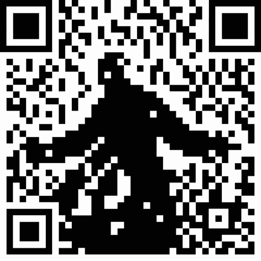

Shawshank
======

Shawshank is a file transportation tool via QR Code.



Setup
-----

```sh
npm install
```

Usage (Development)
-----

```sh
npm run dev
```

Usage (Production)
-----

```sh
npm run build
npm start
```

How it works
-----

1. Select (or drag & drop) a file that you want to transfer.
2. Scan the QR code with your phone to open the scanner page.
3. The file is split into chunks and encoded as QR codes. The scanner reads each chunk and uploads it to the server.
4. When the transfer is complete, a download page appears on the phone.
